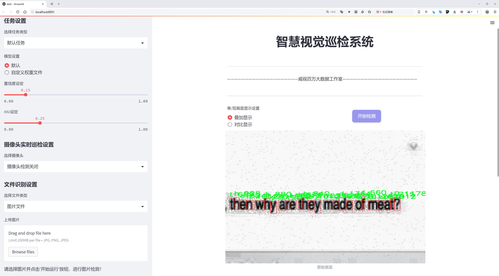

# 文本识别检测系统源码分享
 # [一条龙教学YOLOV8标注好的数据集一键训练_70+全套改进创新点发刊_Web前端展示]

### 1.研究背景与意义

项目参考[AAAI Association for the Advancement of Artificial Intelligence](https://gitee.com/qunmasj/projects)

研究背景与意义

随着信息技术的迅猛发展，文本识别与检测技术在各个领域的应用日益广泛，尤其是在智能监控、自动驾驶、增强现实和人机交互等场景中，文本信息的快速准确识别成为了提升系统智能化水平的重要环节。近年来，深度学习技术的进步为文本识别提供了新的解决方案，其中YOLO（You Only Look Once）系列模型因其高效的实时检测能力而受到广泛关注。YOLOv8作为该系列的最新版本，具备了更强的特征提取能力和更快的推理速度，然而在特定的文本识别任务中，仍然存在一些挑战，如对复杂背景的适应性、对小字符的检测能力以及对多样化字体的识别准确性等。因此，基于改进YOLOv8的文本识别检测系统的研究具有重要的学术价值和实际意义。

本研究将基于一个包含3084张图像和78个类别的文本数据集，探索如何优化YOLOv8模型以提高其在文本识别任务中的表现。该数据集涵盖了多种字符，包括字母、数字、标点符号及特殊符号，反映了现实场景中可能遇到的各种文本信息。这一丰富的类别设置为模型的训练和评估提供了良好的基础，使得研究者能够全面考察模型在不同文本类型下的表现。通过对数据集的深入分析，我们可以识别出模型在特定类别上的薄弱环节，从而为后续的改进提供依据。

在文本识别领域，准确性和实时性是两个关键指标。传统的文本检测方法往往依赖于手工特征提取，无法有效应对复杂的场景变化和文本样式的多样性。而基于YOLOv8的深度学习方法，借助卷积神经网络（CNN）强大的特征学习能力，能够实现对文本信息的自动化识别，显著提高检测效率和准确率。通过对YOLOv8的改进，例如引入更为先进的特征融合技术、优化损失函数以及增强数据集的多样性，我们期望能够提升模型在复杂背景下的文本检测能力。

此外，随着人工智能技术的不断发展，文本识别系统的应用场景也在不断扩展。无论是在文档自动化处理、车牌识别，还是在智能家居设备中，文本识别技术都扮演着不可或缺的角色。因此，研究基于改进YOLOv8的文本识别检测系统，不仅有助于推动学术界在该领域的研究进展，也为工业界提供了实用的技术支持。通过提高文本识别的准确性和实时性，能够为各类应用提供更为可靠的基础，促进智能化技术的普及与应用。

综上所述，基于改进YOLOv8的文本识别检测系统的研究，不仅具有重要的理论意义，也为实际应用提供了新的思路和方法。随着研究的深入，我们期待能够为文本识别技术的发展贡献新的见解和成果，推动相关领域的进一步发展。

### 2.图片演示




##### 注意：由于此博客编辑较早，上面“2.图片演示”和“3.视频演示”展示的系统图片或者视频可能为老版本，新版本在老版本的基础上升级如下：（实际效果以升级的新版本为准）

  （1）适配了YOLOV8的“目标检测”模型和“实例分割”模型，通过加载相应的权重（.pt）文件即可自适应加载模型。

  （2）支持“图片识别”、“视频识别”、“摄像头实时识别”三种识别模式。

  （3）支持“图片识别”、“视频识别”、“摄像头实时识别”三种识别结果保存导出，解决手动导出（容易卡顿出现爆内存）存在的问题，识别完自动保存结果并导出到。

  （4）支持Web前端系统中的标题、背景图等自定义修改，后面提供修改教程。

  另外本项目提供训练的数据集和训练教程,暂不提供权重文件（best.pt）,需要您按照教程进行训练后实现图片演示和Web前端界面演示的效果。

### 3.视频演示

[3.1 视频演示](https://www.bilibili.com/video/BV1DgWXeJEBL/?vd_source=ff015de2d29cbe2a9cdbfa7064407a08)

### 4.数据集信息展示

数据集信息展示

本数据集专为改进YOLOv8的文本识别检测系统而设计，旨在提升模型在多样化文本场景中的识别能力。该数据集包含3084张图像，涵盖了78个类别，涉及各种字符和符号的检测。这些类别包括数字、字母、标点符号以及其他常见的文本元素，确保模型能够在不同的应用场景中准确识别和处理文本信息。

在字符类别方面，数据集提供了从基本的数字（0-9）到完整的字母表（A-Z，a-z），以及多种标点符号（如“!”、“@”、“#”、“&”等）。这些类别的丰富性使得模型在面对复杂文本时能够具备更强的适应性。例如，数字和字母的组合在许多实际应用中都非常常见，如车牌识别、文档扫描和街道标识的自动读取等。

数据集中的图像涵盖了多种背景和环境，以模拟现实世界中可能遇到的各种情况。这种多样性不仅增强了模型的泛化能力，还提高了其在不同光照、角度和干扰条件下的表现。通过训练，YOLOv8能够学习到不同字符在不同场景中的特征，从而实现更高的识别准确率。

此外，该数据集遵循CC BY 4.0许可证，允许用户在遵循相关条款的前提下自由使用和修改数据。这一开放性使得研究人员和开发者能够在此基础上进行创新，推动文本识别技术的进一步发展。用户可以根据自身需求，灵活调整数据集的使用方式，以适应特定的研究或应用场景。

为了便于模型训练和评估，数据集中的每张图像都附带了相应的标注信息。这些标注信息不仅包括字符的类别，还提供了字符在图像中的具体位置，确保模型能够准确地学习到字符的空间特征。这种详细的标注方式为模型的训练提供了坚实的基础，使得YOLOv8在文本检测任务中能够实现更高的精度和效率。

总之，本数据集为改进YOLOv8的文本识别检测系统提供了丰富的资源和支持。通过对3084张图像的训练，模型将能够在多种文本场景中表现出色，满足实际应用的需求。随着文本识别技术的不断进步，期待该数据集能够为相关研究和应用带来新的突破，推动文本识别领域的发展。


### 5.全套项目环境部署视频教程（零基础手把手教学）

[5.1 环境部署教程链接（零基础手把手教学）](https://www.ixigua.com/7404473917358506534?logTag=c807d0cbc21c0ef59de5)


[5.2 安装Python虚拟环境创建和依赖库安装视频教程链接（零基础手把手教学）](https://www.ixigua.com/7404474678003106304?logTag=1f1041108cd1f708b01a)

### 6.手把手YOLOV8训练视频教程（零基础小白有手就能学会）

[6.1 环境部署教程链接（零基础手把手教学）](https://www.ixigua.com/7404477157818401292?logTag=d31a2dfd1983c9668658)

### 7.70+种全套YOLOV8创新点代码加载调参视频教程（一键加载写好的改进模型的配置文件）

[7.1 环境部署教程链接（零基础手把手教学）](https://www.ixigua.com/7404478314661806627?logTag=29066f8288e3f4eea3a4)

### 8.70+种全套YOLOV8创新点原理讲解（非科班也可以轻松写刊发刊，V10版本正在科研待更新）

由于篇幅限制，每个创新点的具体原理讲解就不一一展开，具体见下列网址中的创新点对应子项目的技术原理博客网址【Blog】：


[8.1 70+种全套YOLOV8创新点原理讲解链接](https://gitee.com/qunmasj/good)

### 9.系统功能展示（检测对象为举例，实际内容以本项目数据集为准）

图1.系统支持检测结果表格显示

  图2.系统支持置信度和IOU阈值手动调节

  图3.系统支持自定义加载权重文件best.pt(需要你通过步骤5中训练获得)

  图4.系统支持摄像头实时识别

  图5.系统支持图片识别

  图6.系统支持视频识别

  图7.系统支持识别结果文件自动保存

  图8.系统支持Excel导出检测结果数据


### 10.原始YOLOV8算法原理

原始YOLOv8算法原理

YOLOv8是由Ultralytics公司于2023年推出的最新一代YOLO系列目标检测算法，标志着深度学习领域在实时目标检测技术上的又一次重要进步。相较于前代YOLOv5，YOLOv8在检测精度和速度上均有显著提升，成为当前业界广泛应用的解决方案。YOLOv8不仅在架构上进行了优化，还在模型的灵活性和适应性方面做出了重要改进，适应了不同场景的需求。

YOLOv8的架构可以分为四个主要部分：输入端、骨干网络、颈部网络和头部网络。输入端采用了马赛克数据增强技术，这种方法通过将多张图像拼接在一起，增加了训练数据的多样性，从而提高了模型的鲁棒性。此外，YOLOv8还引入了自适应锚框计算和自适应灰度填充，这些技术使得模型能够更好地适应不同的输入图像，提升了目标检测的准确性。

在骨干网络部分，YOLOv8采用了CSP（Cross Stage Partial）结构，这一设计使得特征提取过程被分为两个部分，分别进行卷积和连接。C2f模块的引入替代了YOLOv5中的C3模块，极大地丰富了梯度流，增强了特征表示能力。C2f模块通过跨层连接的方式，促进了信息的流动，使得模型在学习残差特征时能够更加高效。与此同时，SPPF（Spatial Pyramid Pooling Fusion）模块的使用则进一步提高了模型的计算速度，确保了在复杂场景下的实时性。

颈部网络采用了路径聚合网络（PAN-FPN）结构，这一设计旨在加强不同尺度特征的融合能力。PAN-FPN通过有效地结合来自不同层次的特征，使得模型能够更好地处理多尺度目标，提高了对小目标的检测能力。这一结构的引入，标志着YOLOv8在特征融合技术上的一次重要创新，确保了模型在处理复杂场景时的高效性和准确性。

在头部网络方面，YOLOv8采取了Anchor-Free的检测方式，摆脱了传统锚框的限制。通过解耦头结构，YOLOv8将分类和检测过程分开进行，极大地简化了模型的复杂性。这种解耦设计不仅提高了模型的灵活性，还减少了锚框预测的数量，从而加速了非最大抑制（NMS）过程，提升了整体推理速度。此外，YOLOv8在损失函数的设计上也进行了创新，采用了Task-Aligned Assigner策略来优化正负样本的分配，结合了二元交叉熵损失和分布焦点损失，以提高模型对边界框预测的精准性。

YOLOv8的多种模型版本（如YOLOv8n、YOLOv8s、YOLOv8m等）使得用户可以根据具体需求选择合适的模型。YOLOv8n作为参数量最小且检测速度最快的版本，特别适合对实时性要求较高的应用场景。通过调整depth_factor、width_factor和ratio等参数，用户可以灵活地控制模型的深度和宽度，以适应不同的硬件环境和应用需求。

综上所述，YOLOv8在多个方面的创新和改进，使其在目标检测领域中具备了更高的精度和更快的速度。通过引入先进的网络结构和优化的损失函数，YOLOv8不仅提升了模型的性能，还增强了其在实际应用中的适应性。这些特性使得YOLOv8成为当前目标检测任务中的一项重要工具，广泛应用于自动驾驶、安防监控、智能交通等多个领域，推动了计算机视觉技术的进一步发展。随着YOLOv8的推广和应用，未来的目标检测技术将更加高效、精准，为各行各业带来更多的可能性。


### 11.项目核心源码讲解（再也不用担心看不懂代码逻辑）

#### 11.1 ui.py

以下是经过简化和注释的核心代码部分：

```python
import sys
import subprocess
from QtFusion.path import abs_path

def run_script(script_path):
    """
    使用当前 Python 环境运行指定的脚本。

    Args:
        script_path (str): 要运行的脚本路径
    """
    # 获取当前 Python 解释器的路径
    python_path = sys.executable

    # 构建运行命令，使用 streamlit 运行指定的脚本
    command = f'"{python_path}" -m streamlit run "{script_path}"'

    # 执行命令并等待其完成
    result = subprocess.run(command, shell=True)
    
    # 检查命令执行结果，如果返回码不为0，表示出错
    if result.returncode != 0:
        print("脚本运行出错。")

# 主程序入口
if __name__ == "__main__":
    # 获取脚本的绝对路径
    script_path = abs_path("web.py")

    # 运行指定的脚本
    run_script(script_path)
```

### 代码详细注释：

1. **导入模块**：
   - `sys`：用于访问与 Python 解释器紧密相关的变量和函数。
   - `subprocess`：用于执行外部命令。
   - `abs_path`：从 `QtFusion.path` 模块导入的函数，用于获取文件的绝对路径。

2. **`run_script` 函数**：
   - 该函数接受一个参数 `script_path`，表示要运行的 Python 脚本的路径。
   - 使用 `sys.executable` 获取当前 Python 解释器的路径，以确保使用正确的 Python 环境。
   - 构建一个命令字符串，使用 `streamlit` 模块运行指定的脚本。
   - 使用 `subprocess.run` 执行构建的命令，并等待其完成。
   - 检查命令的返回码，如果不为0，表示脚本运行过程中出现错误，打印错误信息。

3. **主程序入口**：
   - 当脚本作为主程序运行时，首先获取 `web.py` 的绝对路径。
   - 调用 `run_script` 函数来执行该脚本。

这个文件名为 `ui.py`，其主要功能是运行一个指定的 Python 脚本，具体来说是通过 Streamlit 框架来启动一个 Web 应用。

首先，文件导入了几个必要的模块，包括 `sys`、`os` 和 `subprocess`。其中，`sys` 模块用于访问与 Python 解释器相关的变量和函数，`os` 模块提供了与操作系统交互的功能，而 `subprocess` 模块则用于执行外部命令。

接下来，文件从 `QtFusion.path` 导入了 `abs_path` 函数，这个函数的作用是获取文件的绝对路径。

在 `run_script` 函数中，定义了一个参数 `script_path`，它是要运行的脚本的路径。函数首先获取当前 Python 解释器的路径，然后构建一个命令字符串，这个命令使用 Streamlit 来运行指定的脚本。命令的格式是 `python -m streamlit run <script_path>`，其中 `<script_path>` 是传入的脚本路径。

随后，使用 `subprocess.run` 方法执行这个命令。如果命令执行的返回码不为 0，表示脚本运行出错，程序会打印出错误信息。

在文件的最后部分，使用 `if __name__ == "__main__":` 语句来确保当这个文件作为主程序运行时，以下代码才会被执行。这里指定了要运行的脚本路径为 `web.py`，并调用 `run_script` 函数来执行这个脚本。

总的来说，这个 `ui.py` 文件的作用是提供一个简单的接口来启动一个 Streamlit Web 应用，方便用户通过命令行运行指定的 Python 脚本。

#### 11.2 ultralytics\engine\validator.py

以下是代码中最核心的部分，并附上详细的中文注释：

```python
class BaseValidator:
    """
    BaseValidator 类用于创建验证器的基类。

    属性:
        args (SimpleNamespace): 验证器的配置。
        dataloader (DataLoader): 用于验证的数据加载器。
        device (torch.device): 用于验证的设备。
        model (nn.Module): 需要验证的模型。
        speed (dict): 包含预处理、推理、损失和后处理的速度信息。
        jdict (list): 存储 JSON 验证结果的字典。
    """

    def __init__(self, dataloader=None, save_dir=None, args=None, _callbacks=None):
        """
        初始化 BaseValidator 实例。

        参数:
            dataloader (torch.utils.data.DataLoader): 用于验证的数据加载器。
            save_dir (Path, optional): 保存结果的目录。
            args (SimpleNamespace): 验证器的配置。
            _callbacks (dict): 存储各种回调函数的字典。
        """
        self.args = get_cfg(overrides=args)  # 获取配置
        self.dataloader = dataloader  # 数据加载器
        self.device = None  # 设备初始化
        self.model = None  # 模型初始化
        self.speed = {"preprocess": 0.0, "inference": 0.0, "loss": 0.0, "postprocess": 0.0}  # 速度字典
        self.jdict = []  # JSON 结果字典

        # 创建保存结果的目录
        self.save_dir = save_dir or get_save_dir(self.args)
        (self.save_dir / "labels" if self.args.save_txt else self.save_dir).mkdir(parents=True, exist_ok=True)

    @smart_inference_mode()
    def __call__(self, trainer=None, model=None):
        """支持验证预训练模型或正在训练的模型。"""
        self.device = select_device(self.args.device)  # 选择设备
        model = AutoBackend(model or self.args.model, device=self.device)  # 初始化模型
        self.model = model.eval()  # 设置模型为评估模式

        # 遍历数据加载器进行验证
        for batch_i, batch in enumerate(self.dataloader):
            # 预处理
            batch = self.preprocess(batch)

            # 推理
            preds = self.model(batch["img"])

            # 更新指标
            self.update_metrics(preds, batch)

        # 打印结果
        self.print_results()

    def preprocess(self, batch):
        """对输入批次进行预处理。"""
        return batch  # 返回原始批次（可以在这里添加实际的预处理逻辑）

    def update_metrics(self, preds, batch):
        """根据预测和批次更新指标。"""
        pass  # 在这里添加更新指标的逻辑

    def print_results(self):
        """打印模型预测的结果。"""
        pass  # 在这里添加打印结果的逻辑
```

### 代码说明：
1. **BaseValidator 类**：这是一个用于验证模型的基类，包含了模型验证所需的基本属性和方法。
2. **`__init__` 方法**：初始化验证器，设置数据加载器、保存目录和配置参数。
3. **`__call__` 方法**：使得该类的实例可以被调用，进行模型验证的主要逻辑，包括选择设备、初始化模型、遍历数据进行推理等。
4. **`preprocess` 方法**：用于对输入数据进行预处理，可以在此添加具体的预处理逻辑。
5. **`update_metrics` 方法**：用于更新模型的性能指标，可以在此添加具体的指标更新逻辑。
6. **`print_results` 方法**：用于打印验证结果，可以在此添加具体的结果打印逻辑。

以上是代码的核心部分及其详细注释，主要集中在模型验证的流程和基本功能上。

这个程序文件是一个用于验证模型准确性的类的实现，主要是针对Ultralytics YOLO（You Only Look Once）系列模型的。它的核心功能是对给定的数据集进行验证，评估模型在测试集或验证集上的表现。

首先，文件开头提供了使用该验证器的基本命令行示例，用户可以通过指定模型文件、数据集配置文件和图像大小等参数来运行验证。支持多种模型格式，包括PyTorch、ONNX、TensorRT等。

在代码的主体部分，定义了一个名为`BaseValidator`的类，作为验证器的基类。这个类包含了多个属性和方法，用于处理验证过程中的各种任务。属性包括配置参数、数据加载器、模型、设备信息、统计数据等。构造函数`__init__`用于初始化这些属性，并设置保存结果的目录。

`__call__`方法是验证的主要入口，支持对预训练模型或正在训练的模型进行验证。根据是否传入训练器对象，方法会选择不同的方式来获取模型和数据集，并进行相应的预处理和推理。它还会记录每个步骤的时间，以便后续分析模型的速度表现。

在验证过程中，程序会通过一个进度条显示当前的处理进度，并在每个批次开始和结束时运行相应的回调函数。验证的每个批次包括预处理、推理、损失计算和后处理等步骤。程序会更新各种性能指标，并在每个批次中进行可视化。

此外，`BaseValidator`类还定义了一些辅助方法，例如`match_predictions`用于将预测结果与真实标签进行匹配，`add_callback`和`run_callbacks`用于管理和执行回调函数，`get_dataloader`和`build_dataset`用于获取数据加载器和构建数据集。

最后，类中还包含一些用于初始化、更新和最终化性能指标的方法，尽管这些方法的具体实现并未在此类中给出，可能会在子类中实现。

总的来说，这个文件提供了一个灵活的框架，允许用户在不同的YOLO模型上进行验证，并能够通过回调机制扩展功能，适应不同的需求。

#### 11.3 ultralytics\data\split_dota.py

以下是经过简化并附有详细中文注释的核心代码部分：

```python
import itertools
import numpy as np
from pathlib import Path
import cv2
from PIL import Image
from tqdm import tqdm

def load_yolo_dota(data_root, split="train"):
    """
    加载DOTA数据集。

    参数:
        data_root (str): 数据根目录。
        split (str): 数据集分割，可以是train或val。
    
    返回:
        annos (list): 包含每个图像的原始大小、标签和文件路径的字典列表。
    """
    assert split in ["train", "val"]
    im_dir = Path(data_root) / "images" / split
    assert im_dir.exists(), f"找不到 {im_dir}，请检查数据根目录。"
    im_files = glob(str(Path(data_root) / "images" / split / "*"))
    annos = []
    for im_file in im_files:
        w, h = exif_size(Image.open(im_file))  # 获取图像的原始尺寸
        lb_file = img2label_paths([im_file])[0]  # 获取对应的标签文件路径
        with open(lb_file) as f:
            lb = [x.split() for x in f.read().strip().splitlines() if len(x)]
            lb = np.array(lb, dtype=np.float32)  # 转换为浮点数数组
        annos.append(dict(ori_size=(h, w), label=lb, filepath=im_file))  # 保存信息
    return annos

def get_windows(im_size, crop_sizes=[1024], gaps=[200], im_rate_thr=0.6):
    """
    获取窗口的坐标。

    参数:
        im_size (tuple): 原始图像大小，(高, 宽)。
        crop_sizes (List(int)): 窗口的裁剪大小。
        gaps (List(int)): 窗口之间的间隔。
        im_rate_thr (float): 窗口面积与图像面积的阈值。
    
    返回:
        windows (np.ndarray): 窗口的坐标数组。
    """
    h, w = im_size
    windows = []
    for crop_size, gap in zip(crop_sizes, gaps):
        step = crop_size - gap
        xn = 1 if w <= crop_size else ceil((w - crop_size) / step + 1)
        xs = [step * i for i in range(xn)]
        if len(xs) > 1 and xs[-1] + crop_size > w:
            xs[-1] = w - crop_size

        yn = 1 if h <= crop_size else ceil((h - crop_size) / step + 1)
        ys = [step * i for i in range(yn)]
        if len(ys) > 1 and ys[-1] + crop_size > h:
            ys[-1] = h - crop_size

        start = np.array(list(itertools.product(xs, ys)), dtype=np.int64)
        stop = start + crop_size
        windows.append(np.concatenate([start, stop], axis=1))
    windows = np.concatenate(windows, axis=0)

    # 计算窗口的有效性
    im_in_wins = windows.copy()
    im_in_wins[:, 0::2] = np.clip(im_in_wins[:, 0::2], 0, w)
    im_in_wins[:, 1::2] = np.clip(im_in_wins[:, 1::2], 0, h)
    im_areas = (im_in_wins[:, 2] - im_in_wins[:, 0]) * (im_in_wins[:, 3] - im_in_wins[:, 1])
    win_areas = (windows[:, 2] - windows[:, 0]) * (windows[:, 3] - windows[:, 1])
    im_rates = im_areas / win_areas
    return windows[im_rates > im_rate_thr]  # 返回有效窗口

def crop_and_save(anno, windows, window_objs, im_dir, lb_dir):
    """
    裁剪图像并保存新的标签。

    参数:
        anno (dict): 注释字典，包括`filepath`、`label`、`ori_size`。
        windows (list): 窗口坐标列表。
        window_objs (list): 每个窗口内的标签列表。
        im_dir (str): 图像输出目录路径。
        lb_dir (str): 标签输出目录路径。
    """
    im = cv2.imread(anno["filepath"])  # 读取图像
    name = Path(anno["filepath"]).stem  # 获取图像文件名
    for i, window in enumerate(windows):
        x_start, y_start, x_stop, y_stop = window.tolist()  # 窗口坐标
        new_name = f"{name}__{x_stop - x_start}__{x_start}___{y_start}"  # 新文件名
        patch_im = im[y_start:y_stop, x_start:x_stop]  # 裁剪图像
        cv2.imwrite(str(Path(im_dir) / f"{new_name}.jpg"), patch_im)  # 保存裁剪后的图像

        label = window_objs[i]  # 获取窗口内的标签
        if len(label) == 0:
            continue
        # 处理标签坐标
        label[:, 1::2] -= x_start
        label[:, 2::2] -= y_start
        label[:, 1::2] /= (x_stop - x_start)
        label[:, 2::2] /= (y_stop - y_start)

        # 保存标签
        with open(Path(lb_dir) / f"{new_name}.txt", "w") as f:
            for lb in label:
                formatted_coords = ["{:.6g}".format(coord) for coord in lb[1:]]
                f.write(f"{int(lb[0])} {' '.join(formatted_coords)}\n")

def split_images_and_labels(data_root, save_dir, split="train", crop_sizes=[1024], gaps=[200]):
    """
    分割图像和标签。

    参数:
        data_root (str): 数据根目录。
        save_dir (str): 保存目录。
        split (str): 数据集分割，可以是train或val。
        crop_sizes (List(int)): 窗口的裁剪大小。
        gaps (List(int)): 窗口之间的间隔。
    """
    im_dir = Path(save_dir) / "images" / split
    im_dir.mkdir(parents=True, exist_ok=True)  # 创建图像保存目录
    lb_dir = Path(save_dir) / "labels" / split
    lb_dir.mkdir(parents=True, exist_ok=True)  # 创建标签保存目录

    annos = load_yolo_dota(data_root, split=split)  # 加载数据集
    for anno in tqdm(annos, total=len(annos), desc=split):
        windows = get_windows(anno["ori_size"], crop_sizes, gaps)  # 获取窗口
        window_objs = get_window_obj(anno, windows)  # 获取窗口内的对象
        crop_and_save(anno, windows, window_objs, str(im_dir), str(lb_dir))  # 裁剪并保存

if __name__ == "__main__":
    split_images_and_labels(data_root="DOTAv2", save_dir="DOTAv2-split", split="train")
    split_images_and_labels(data_root="DOTAv2", save_dir="DOTAv2-split", split="val")
```

### 代码说明：
1. **load_yolo_dota**: 加载DOTA数据集，返回包含图像原始大小、标签和文件路径的字典列表。
2. **get_windows**: 根据图像大小和给定的裁剪大小与间隔，计算并返回有效的窗口坐标。
3. **crop_and_save**: 根据窗口坐标裁剪图像并保存，同时调整标签坐标并保存标签文件。
4. **split_images_and_labels**: 分割图像和标签，创建保存目录并处理每个图像。

### 注意事项：
- 该代码假设数据集的目录结构符合DOTA数据集的标准。
- 使用OpenCV和PIL库进行图像处理和文件操作。

这个程序文件的主要功能是处理DOTA（Dataset for Object Detection in Aerial Images）数据集，具体是将图像和标签进行切分，以便于后续的训练和测试。程序中包含多个函数，每个函数负责不同的任务，整体上形成了一个完整的工作流程。

首先，程序导入了一些必要的库，包括用于文件操作的`Path`，用于图像处理的`cv2`和`PIL`，以及用于数值计算的`numpy`。此外，还导入了`shapely`库来处理几何形状。

程序定义了一个计算交并比（IOF）的函数`bbox_iof`，该函数接受多边形和边界框作为输入，计算它们之间的重叠区域。这个函数在后续处理中用于判断切分窗口与目标物体之间的重叠程度。

接下来，`load_yolo_dota`函数用于加载DOTA数据集中的图像和标签。它会根据给定的路径读取图像和相应的标签文件，并将它们存储在一个字典中，包含原始图像的尺寸、标签和文件路径。

`get_windows`函数用于生成切分窗口的坐标。它接受图像的尺寸、切分大小和间隔作为参数，计算出可以在图像上切分的窗口位置，并返回这些窗口的坐标。

`get_window_obj`函数则用于获取每个窗口内的目标物体。它会根据标签信息和窗口的坐标，判断哪些目标物体位于窗口内，并返回这些物体的标签。

`crop_and_save`函数负责根据窗口坐标从原始图像中裁剪出对应的图像块，并保存这些图像块和更新后的标签。它会为每个裁剪的图像生成新的文件名，并将其保存到指定的目录中。

`split_images_and_labels`函数是整个处理流程的核心，它会调用前面定义的函数，依次加载数据、生成窗口、获取窗口内的目标物体，并进行裁剪和保存。它支持处理训练集和验证集。

`split_trainval`和`split_test`函数分别用于处理训练集和测试集。它们会根据给定的参数调用`split_images_and_labels`函数，进行数据的切分和保存。

最后，在`__main__`部分，程序会执行`split_trainval`和`split_test`函数，指定数据集的根目录和保存目录，从而开始整个数据处理的流程。

总的来说，这个程序实现了DOTA数据集的图像和标签的切分功能，适用于目标检测任务的准备工作。通过切分，程序能够将大图像分割成多个小图像，并相应地调整标签信息，方便后续的模型训练和评估。

#### 11.4 ultralytics\utils\callbacks\dvc.py

以下是代码中最核心的部分，并附上详细的中文注释：

```python
# 导入必要的库
from ultralytics.utils import LOGGER, SETTINGS, TESTS_RUNNING, checks

try:
    # 确保没有在运行测试
    assert not TESTS_RUNNING  
    # 确保DVC集成已启用
    assert SETTINGS["dvc"] is True  
    import dvclive  # 导入DVCLive库

    # 检查DVCLive版本
    assert checks.check_version("dvclive", "2.11.0", verbose=True)

    import os
    import re
    from pathlib import Path

    # 初始化DVCLive日志实例
    live = None
    _processed_plots = {}  # 存储已处理的图表

    # 用于区分最佳模型的最终评估与最后一个epoch的验证
    _training_epoch = False

except (ImportError, AssertionError, TypeError):
    dvclive = None  # 如果导入失败，dvclive设置为None


def _log_images(path, prefix=""):
    """使用DVCLive记录指定路径的图像，带有可选前缀。"""
    if live:  # 如果DVCLive实例存在
        name = path.name

        # 根据批次分组图像，以便在UI中启用滑块
        m = re.search(r"_batch(\d+)", name)
        if m:
            ni = m[1]
            new_stem = re.sub(r"_batch(\d+)", "_batch", path.stem)
            name = (Path(new_stem) / ni).with_suffix(path.suffix)

        # 记录图像
        live.log_image(os.path.join(prefix, name), path)


def on_train_end(trainer):
    """在训练结束时，如果DVCLive处于活动状态，记录最佳指标、图表和混淆矩阵。"""
    if live:
        # 记录最佳指标
        all_metrics = {**trainer.label_loss_items(trainer.tloss, prefix="train"), **trainer.metrics, **trainer.lr}
        for metric, value in all_metrics.items():
            live.log_metric(metric, value, plot=False)

        # 记录验证集的图表
        _log_plots(trainer.plots, "val")
        _log_plots(trainer.validator.plots, "val")
        _log_confusion_matrix(trainer.validator)  # 记录混淆矩阵

        # 如果最佳模型存在，记录模型文件
        if trainer.best.exists():
            live.log_artifact(trainer.best, copy=True, type="model")

        live.end()  # 结束DVCLive日志记录


# 回调函数集合
callbacks = (
    {
        "on_train_end": on_train_end,  # 训练结束时的回调
    }
    if dvclive  # 如果DVCLive可用
    else {}
)
```

### 代码核心部分说明：
1. **导入和初始化**：
   - 导入必要的库和模块，确保DVC集成已启用，并检查DVCLive的版本。
   - 初始化DVCLive日志实例和处理过的图表的字典。

2. **图像记录函数**：
   - `_log_images`函数用于记录图像，并根据批次进行分组，以便在用户界面中显示滑块。

3. **训练结束时的回调**：
   - `on_train_end`函数在训练结束时被调用，记录最佳指标、验证集的图表和混淆矩阵，并结束DVCLive的日志记录。

4. **回调函数集合**：
   - 根据DVCLive的可用性，定义回调函数集合，便于在训练过程中调用。

这个程序文件 `dvc.py` 是 Ultralytics YOLO 项目中的一部分，主要用于集成 DVCLive 日志记录功能，以便在训练模型时记录和可视化训练过程中的各种指标和信息。文件中首先导入了一些必要的模块和库，包括日志记录器、设置和检查工具。接着，代码通过断言确保在测试运行时不记录日志，并验证 DVCLive 集成是否启用。

如果 DVCLive 成功导入，程序会创建一个 DVCLive 日志实例 `live`，并定义一个字典 `_processed_plots` 用于跟踪已处理的图像。接下来，定义了一些私有函数用于记录图像、绘图和混淆矩阵。这些函数会在训练过程中被调用，以便将相应的数据记录到 DVCLive 中。

`_log_images` 函数用于记录指定路径下的图像，支持可选的前缀，并通过正则表达式对图像进行分组，以便在用户界面中实现滑块功能。`_log_plots` 函数则用于记录训练进度中的绘图，如果绘图未被处理过，则调用 `_log_images` 进行记录。`_log_confusion_matrix` 函数用于记录混淆矩阵，提取目标和预测的标签，并将其记录到 DVCLive 中。

接下来的几个函数是训练过程中的回调函数，包括在预训练开始和结束时、训练开始时、每个训练周期开始时、每个拟合周期结束时以及训练结束时的处理逻辑。在预训练开始时，初始化 DVCLive 日志记录器，并在日志中记录相关信息。在训练开始时，记录训练参数；在每个训练周期开始时，设置一个全局变量 `_training_epoch` 为真，以标识当前处于训练周期中。

在每个拟合周期结束时，记录训练指标和模型信息，并将绘图数据记录到 DVCLive 中。最后，在训练结束时，记录最佳指标、绘图和混淆矩阵，并将最佳模型保存到日志中。

文件的最后部分定义了一个回调字典 `callbacks`，根据 DVCLive 是否可用来决定是否注册这些回调函数。这些回调函数在训练过程中会被自动调用，以实现实时的训练监控和记录。整体上，这个文件的功能是增强模型训练过程中的可视化和监控能力，使得用户能够更好地理解和分析训练过程。

#### 11.5 ultralytics\models\rtdetr\__init__.py

以下是代码中最核心的部分，并附上详细的中文注释：

```python
# 导入RTDETR模型、预测器和验证器
from .model import RTDETR  # 导入RTDETR模型类
from .predict import RTDETRPredictor  # 导入RTDETR预测器类
from .val import RTDETRValidator  # 导入RTDETR验证器类

# 定义模块的公开接口，包含可供外部使用的类
__all__ = "RTDETRPredictor", "RTDETRValidator", "RTDETR"  # 指定在使用from module import *时可导入的类
```

### 注释说明：
1. **导入模块**：
   - `from .model import RTDETR`：从当前包的`model`模块中导入`RTDETR`类，通常这个类用于定义模型的结构和功能。
   - `from .predict import RTDETRPredictor`：从当前包的`predict`模块中导入`RTDETRPredictor`类，这个类通常用于对输入数据进行预测。
   - `from .val import RTDETRValidator`：从当前包的`val`模块中导入`RTDETRValidator`类，这个类通常用于验证模型的性能。

2. **定义公开接口**：
   - `__all__`：这是一个特殊的变量，用于定义当使用`from module import *`时，哪些名称是可以被导入的。在这里，`RTDETRPredictor`、`RTDETRValidator`和`RTDETR`这三个类被指定为模块的公开接口。

这个程序文件是一个Python模块的初始化文件，位于Ultralytics YOLO项目的RTDETR子目录下。文件的主要功能是导入该模块中定义的类和函数，并将它们暴露给外部使用。

首先，文件开头的注释部分标明了该项目是Ultralytics YOLO的一部分，并且使用的是AGPL-3.0许可证。这表明该代码是开源的，并且遵循特定的许可证条款。

接下来，文件通过相对导入的方式引入了三个主要组件：`RTDETR`、`RTDETRPredictor`和`RTDETRValidator`。这些组件分别定义在该模块的不同文件中。`RTDETR`可能是一个模型类，负责定义和实现RTDETR模型的结构和功能；`RTDETRPredictor`则可能是一个用于进行预测的类，提供了模型推理的相关方法；而`RTDETRValidator`则可能用于模型验证，评估模型在特定数据集上的表现。

最后，`__all__`变量的定义指定了当使用`from module import *`语句时，哪些名称会被导入。这里列出的名称包括`RTDETRPredictor`、`RTDETRValidator`和`RTDETR`，这意味着这三个类是该模块的主要接口，用户可以直接使用它们。

总的来说，这个初始化文件的作用是组织和简化模块的结构，使得用户能够方便地访问和使用RTDETR相关的功能。

#### 11.6 train.py

以下是代码中最核心的部分，并附上详细的中文注释：

```python
import os
import torch
import yaml
from ultralytics import YOLO  # 导入YOLO模型
from QtFusion.path import abs_path  # 导入获取绝对路径的函数

# 设置设备为GPU（如果可用），否则使用CPU
device = "0" if torch.cuda.is_available() else "cpu"

if __name__ == '__main__':  # 确保该模块被直接运行时才执行以下代码
    workers = 1  # 设置数据加载的工作进程数量
    batch = 2  # 设置每个批次的大小

    data_name = "data"  # 数据集名称
    # 获取数据集yaml文件的绝对路径
    data_path = abs_path(f'datasets/{data_name}/{data_name}.yaml', path_type='current')  
    unix_style_path = data_path.replace(os.sep, '/')  # 将路径转换为Unix风格

    # 获取数据集目录路径
    directory_path = os.path.dirname(unix_style_path)
    
    # 读取YAML文件，保持原有顺序
    with open(data_path, 'r') as file:
        data = yaml.load(file, Loader=yaml.FullLoader)
    
    # 修改YAML文件中的path项为数据集目录路径
    if 'path' in data:
        data['path'] = directory_path
        # 将修改后的数据写回YAML文件
        with open(data_path, 'w') as file:
            yaml.safe_dump(data, file, sort_keys=False)

    # 加载预训练的YOLOv8模型
    model = YOLO(model='./ultralytics/cfg/models/v8/yolov8s.yaml', task='detect')  
    
    # 开始训练模型
    results2 = model.train(  
        data=data_path,  # 指定训练数据的配置文件路径
        device=device,  # 指定训练设备
        workers=workers,  # 指定数据加载的工作进程数量
        imgsz=640,  # 指定输入图像的大小为640x640
        epochs=100,  # 指定训练100个epoch
        batch=batch,  # 指定每个批次的大小
        name='train_v8_' + data_name  # 指定训练任务的名称
    )
```

### 代码说明：
1. **导入库**：导入必要的库，包括操作系统相关的`os`、深度学习框架`torch`、YAML文件处理库`yaml`以及YOLO模型库。
2. **设备选择**：根据是否有可用的GPU，选择训练设备为GPU或CPU。
3. **数据集配置**：定义数据集名称并获取相应的YAML配置文件的绝对路径。
4. **路径处理**：将路径转换为Unix风格，并提取出数据集的目录路径。
5. **读取和修改YAML文件**：读取YAML文件内容，修改其中的`path`项为数据集目录路径，并将修改后的内容写回文件。
6. **模型加载**：加载预训练的YOLOv8模型配置。
7. **模型训练**：调用`train`方法开始训练模型，设置训练数据、设备、工作进程、图像大小、训练轮数和批次大小等参数。

这个程序文件 `train.py` 是一个用于训练 YOLOv8 模型的脚本。首先，它导入了必要的库，包括 `os`、`torch`、`yaml` 和 `ultralytics` 中的 YOLO 模型。接着，程序通过检查 CUDA 是否可用来决定使用 GPU 还是 CPU 进行训练。

在 `if __name__ == '__main__':` 这一部分，程序确保只有在直接运行该脚本时才会执行后续代码。它定义了一些训练参数，包括工作进程数 `workers` 和批次大小 `batch`。接下来，程序指定了数据集的名称，这里使用的是 `"data"`，并构建了数据集 YAML 文件的绝对路径。

程序通过 `abs_path` 函数获取数据集 YAML 文件的绝对路径，并将路径中的分隔符转换为 Unix 风格。然后，它获取该路径的目录，并打开 YAML 文件以读取数据。读取后，程序检查 YAML 数据中是否包含 `path` 项，如果有，则将其修改为数据集的目录路径，并将更新后的数据写回 YAML 文件。

接下来，程序加载预训练的 YOLOv8 模型，指定了模型的配置文件。之后，调用 `model.train()` 方法开始训练模型。在训练过程中，程序指定了训练数据的配置文件路径、设备（CPU 或 GPU）、工作进程数、输入图像的大小（640x640）、训练的轮数（100 个 epoch）以及训练任务的名称。

总的来说，这个脚本的主要功能是配置并启动 YOLOv8 模型的训练过程，确保数据集路径正确，并设置训练的各项参数。

### 12.系统整体结构（节选）

### 整体功能和构架概括

该项目是一个基于Ultralytics YOLO框架的目标检测系统，旨在提供一个完整的训练、验证和推理流程。项目的结构清晰，包含多个模块和子模块，每个模块负责特定的功能。主要功能包括数据集处理、模型训练、模型验证、可视化、以及对不同模型的支持（如RTDETR和FastSAM）。通过使用不同的回调机制和工具，用户可以方便地监控训练过程并记录相关指标。

### 文件功能整理表

| 文件路径                                      | 功能描述                                                   |
|-----------------------------------------------|-----------------------------------------------------------|
| `ui.py`                                       | 提供一个接口来启动Streamlit Web应用，方便用户运行指定的Python脚本。 |
| `ultralytics/engine/validator.py`            | 定义模型验证器，评估模型在测试集或验证集上的表现。         |
| `ultralytics/data/split_dota.py`             | 处理DOTA数据集，切分图像和标签，以便于训练和测试。         |
| `ultralytics/utils/callbacks/dvc.py`        | 集成DVCLive日志记录功能，实时记录和可视化训练过程中的指标。 |
| `ultralytics/models/rtdetr/__init__.py`     | 初始化RTDETR模块，导入和暴露RTDETR相关的类和函数。       |
| `train.py`                                    | 配置并启动YOLOv8模型的训练过程，处理数据集路径和训练参数。 |
| `ultralytics/hub/session.py`                 | 处理与Ultralytics Hub的会话管理，支持模型的加载和保存。   |
| `ui_style.py`                                 | 定义Streamlit应用的样式和布局，提升用户界面的美观性。     |
| `ultralytics/__init__.py`                    | 初始化Ultralytics模块，导入核心功能和模型。               |
| `ultralytics/models/fastsam/model.py`        | 定义FastSAM模型的结构和功能，支持快速目标检测。           |

这个表格提供了项目中各个文件的功能概述，帮助用户理解项目的整体架构和各个模块的作用。

注意：由于此博客编辑较早，上面“11.项目核心源码讲解（再也不用担心看不懂代码逻辑）”中部分代码可能会优化升级，仅供参考学习，完整“训练源码”、“Web前端界面”和“70+种创新点源码”以“13.完整训练+Web前端界面+70+种创新点源码、数据集获取”的内容为准。

### 13.完整训练+Web前端界面+70+种创新点源码、数据集获取


#完整训练+Web前端界面+70+种创新点源码、数据集获取链接

https://mbd.pub/o/bread/ZpqUlJ5s